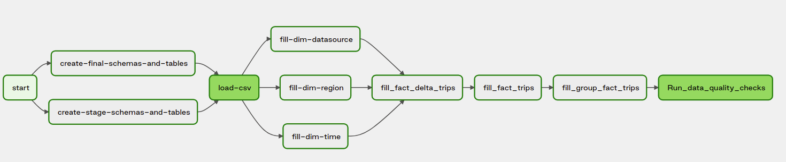

# Ingest on demand

This project has as output a Data warehouse solution. It includes building an ETL pipeline using an Airflow DAG that
extracts their data from Google Drive, stages them in a PostgreSQL instance, and transforms data into a set of
dimensional tables.

Additional, there is an API service to analyze the data ingested.

---

## Prerequisites

The environment needed for this project:

1. [Airflow - Astronomer Software](https://docs.astronomer.io/software/quickstart/)

### Explanation of the files in the repository

1. **app_api:** Flask application folder for the API service.
    1. **api.py** main application file, it contains the endpoints definition and methods to use
    2. **helper.py** helper functions
    3. **settings.py** configuration file for the application
    4. **sql_queries.py** individual queries to use by the service
2. **ingest_on_demand:** etl pipeline folder, for the etl it is used as a module.
    1. **sql_scripts** folder to contain the sql scripts to execute
        1. **ddl_scripts.py** perform ddl (data definition language) scripts
        2. **dml_scripts.py** perform dml (data manipulation language) scripts
    2. **cli.py** file with command line interface to execute the steps of the etl
    3. **etl.py** functions to perform the etl pipeline
    4. **settings.py** configuration file for the etl pipeline
3. **requirement.txt** libraries to install
4. **run_ingest_on_demand.sh** shell script to run the etl pipeline
5. **sql_queries** sql files as sample queries
6. **airflow_implementation** airflow implementation

### Instructions to run the etl pipeline

1. clone the github repository: `git clone https://github.com/Erickramirez/ingest_on_demand.git`
2. verify the prerequisites
3. go to `airflow_implementation`: `cd airflow_implementation`
4. run airflow: `astro dev stop && astro dev start`
5. open a web browser
6. go to `http://localhost:8080/`
7. The default credentials are `admin`:`admin`
8. enable the dag: `ingest_on_demand`
9. run the dag: `ingest_on_demand`

### Instructions to run the application

run the command:

```
FLASK_APP=app_api/api.py flask run
```

use a postman or another API platform, and conect to: `http://127.0.0.1:5000/`
current operations:

- **GET**:
    - http://127.0.0.1:5000/regions returns the list of regions
    - http://127.0.0.1:5000/datasources returns the list of datasources
    - http://127.0.0.1:5000/last_log_event returns the last log event generated and its status
- **POST**:
    - http://127.0.0.1:5000/check_position checks intersections of a visited area, it needs latitude and longitude
      points. This is a sample of body to send: `{"latitude": 7.662608916626361, "longitude":45.07378523979249}`

## Instructions to run it in Docker

execute `./run_docker.sh -b Dockerfile` and then follow up `the instructions to run the etl pipeline` Note: it doesn't
have a postgeSQL instance installed

### Sources of data

source| location                                                                                       | 
--- |------------------------------------------------------------------------------------------------| 
Google drive | [csv file](https://drive.google.com/file/d/14JcOSJAWqKOUNyadVZDPm7FplA7XYhrU/view?usp=sharing) | 

## About the Data Warehouse solution

### Datasets

1. **trips data:** [csv file](https://drive.google.com/file/d/14JcOSJAWqKOUNyadVZDPm7FplA7XYhrU/view?usp=sharing)
   raw data similar to:

| region| origin_coord|  destination_coord| datetime|datasource|
|--- |------------------------------------------------------------------------------------------------| ---| ---| ---| 
|Prague| POINT (14.4973794438195 50.00136875782316)|  POINT (14.43109483523328 50.04052930943246)| 2018-05-28 09:03:40|funny_car|
|Turin| POINT (7.672837913286881 44.9957109242058)|  POINT (7.720368637535126 45.06782385393849)| 2018-05-21 02:54:04|baba_car|

### Database Schema

It will be necessary to copy download the file, and load the data into a staging table. After this staging table, the
data is loaded into dimension and fact tables. This table definition is in `ddl_scripts.py`

1. **Staging tables** They are in the schema named: `trips_stage`
    - **trips_stage.trips** source data, This files will be portions of the total data then it is a delta load
    - **trips_stage.fact_delta_trips** Data processed for a file, this data will be integrated to the fact
      table: `trips.fact_trips`
2. **Dimension tables** They are in the schema named: `trips`
    - **trips.dim_regions:** catalog of regions - region_id, region
    - **trips.dim_datasource:** catalog of datasources - datasource_id, datasource
    - **trips.dim_event_time:** timestamps of records in the data source broken down into specific units - start_time,
      hour, day, week, month, year, weekday
3. **Fact tables** They are in the schema named: `trips`
    - **trips.fact_trips:** records in event data associated with trips. event_timestamp, event_id, region_id,
      datasource_id, origin_coord, destination_coord
    - **trips.fact_group_trips:** aggregate fact table based on region and date to get the area of that combination and
      the total number of trips. event_date, region_id, box_coord, number_of_trips To allow scalability the fact tables
      are partitioned by year and month,on the column `event_timestamp`

### ETL Pipeline



The data is extracted from Google
drive [csv file](https://drive.google.com/file/d/14JcOSJAWqKOUNyadVZDPm7FplA7XYhrU/view?usp=sharing) to the explained
Datasets. It is necessary to transform the data into the dimensions and facts; it is performed by downloading the file
and loading it into a clean stage table. Some of the transformations are related only to selecting some columns and
removing the duplicated data (distinct), and in other cases, it is necessary to modify the type; for instance, the
string of geometric point in points (geometric type)
The ETL for both dataset are in the methods: execute_pg_tasks and load_csv in the file etl.py, To log each step there is
decorators to write logs over each event.

1. **start** Dummy operator
2. **create-stage-schemas-and-tables** create the schema:  `trips_stage` and tables in `Staging tables`
3. **create-final-schemas-and-tables** create the schema:  `trips` and tables in `Dimension tables` and `Fact tables`
4. **load-csv** load table
   from [csv file](https://drive.google.com/file/d/14JcOSJAWqKOUNyadVZDPm7FplA7XYhrU/view?usp=sharing) to
   table `trips_stage.trips`
5. **fill dimension tables** update dimension tables:
    1. **fill-dim-datasource**
    2. **fill-dim-region**
    3. **fill-dim-time**
6. **fill_fact_delta_trips** truncate and fill delta fact table
7. **fill_fact_trips** update fact tables with fact delta table
8. **fill_group_fact_trips** perform aggregate fact table
9. **Run_data_quality_checks** check if the tables have data

### Features:

- It is an automated process to ingest and store the data
- Trips with similar origin, destination, and time of day should be grouped together. Table created: **
  trips.fact_group_trips:**
- Inform about the status: consume airflow logs using the connection`airflow_db` (localhost:5432/postgres)
- Scalability: It is using a delta approach, and the fact tables have partitions
- Container solution with astronomer
- queries to answer these questions, check the folder: `sql_queries`

### Features to improve

- Use a maintenance of partitions, using `partman`
- For scalability, the partitions will work fine for millions of rows, but a better data solution will be using column
  base storage
- Add more QA steps to check integrity of the data
- If these are events from devices, a better solution will be a data streaming pipeline
- Add parameters to the airflow solution
- Cloud Provider set up for GCP
  - Create a data lake using GCS
  - Use cloud composer as airflow solution
  - Use kubernetes secret for the connections to get a better security configuration.
  - To create a complete Docker solution use the folder `ingest_on_demand` as an image in the Container Registry and  [GKEStartPodOperator](https://airflow.apache.org/docs/apache-airflow-providers-google/stable/operators/cloud/kubernetes_engine.html)
  - For the DB solution use Clod SQL instances 